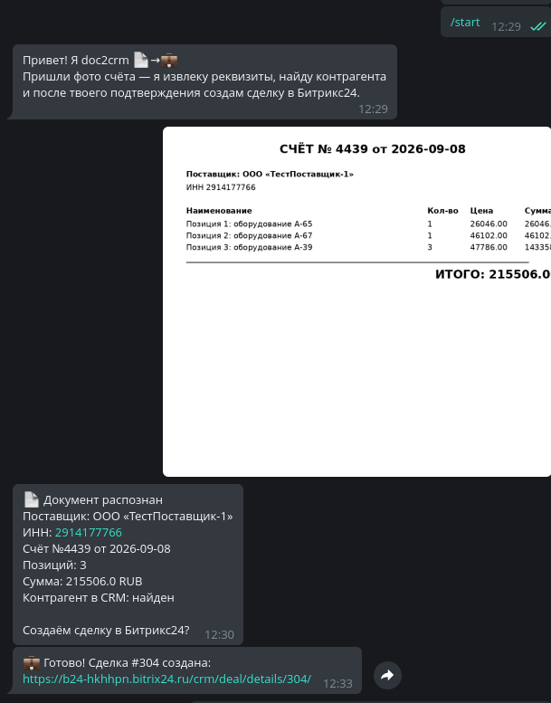
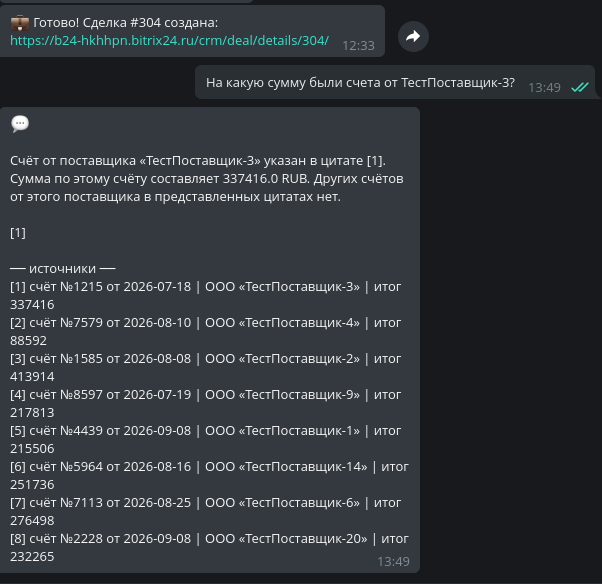
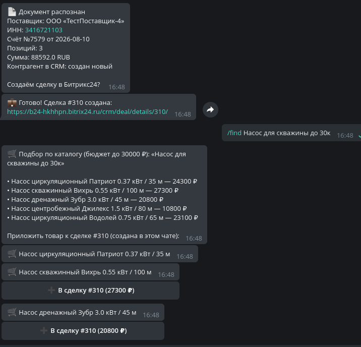
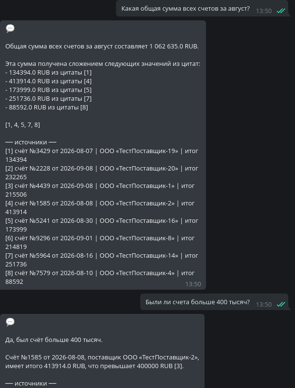
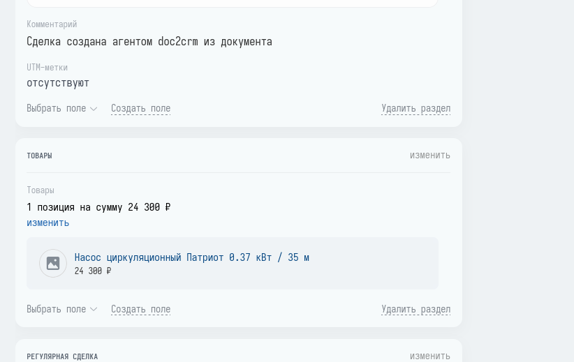

# doc2crm

> Агент «пришёл документ — появилась сделка»: фото счёта в Telegram →
> оформленная сделка в Битрикс24. Извлечение полей, поиск контрагента,
> подбор товаров из каталога, подтверждение человеком.

## Как это выглядит

| 📸 Фото счёта → распознавание → сделка | 🔎 Вопрос по документам с цитатами |
|---|---|
|  |  |

| 🛒 `/find`: подбор товаров по бюджету | 🧮 Агрегация по документам |
|---|---|
|  |  |

| 💼 Товар приложен агентом (вид в CRM) | ✅ Валидатор ловит сомнения модели |
|---|---|
|  | *низкая уверенность поля -> предупреждение до подтверждения* |

Полный цикл: фото счёта из Telegram → распознанные реквизиты с подтверждением
человека → сделка в Битрикс24 → `/find` подобрал товары под бюджет «до 30к» →
товар приложен к сделке (вид в CRM) → по загруженным документам можно спрашивать.

**Статус: в активной разработке.** Архитектура — [ARCHITECTURE.md](ARCHITECTURE.md).

## Что это

Production-minded MVP на актуальном AI-стеке 2026:

- **Агент на LangGraph** — граф состояний `extract → validate → ingest → match → confirm → execute`:
  checkpointing, прерывание графа для human-in-the-loop, возобновление по решению человека
- **Интеграция с Битрикс24**: собственный асинхронный клиент (rate-limiting ~2 rps,
  batch до 50 операций, backoff), поиск/создание контрагентов по ИНН, сделки, таймлайн
- **RAG по документам**: каждый обработанный счёт попадает в pgvector
  (вектор + полнотекстовый индекс, гибридный поиск через RRF) — и по нему
  можно задавать вопросы с цитатами источников
- **RAG по товарному каталогу**: проекция каталога Битрикса, семантический
  поиск «клиенту нужен насос для скважины 30 метров до 30к»
- **Провайдер-агностик LLM-слой**: OpenRouter / DeepSeek / GigaChat / YandexGPT /
  self-hosted vLLM + Qwen через OpenAI-совместимый API — под требования 152-ФЗ
- **Локальные эмбеддинги** (fastembed/ONNX): тексты документов не покидают контур

## Метрики извлечения (eval)

Модель: `dots-studio/dots-3-note-preview:free` (OpenRouter, OpenAI-совместимый
протокол). Сет: 20 синтетических счетов с ground truth, у двух намеренно
«сломан» ИНН — для проверки анти-галлюцинационного валидатора.

| Метрика | dots-3-note:free (OpenRouter) | gemma-3-12b (HF Router) |
|---|---|---|
| Точность по полям (5 полей × 20 документов) | **100%** | **100%** (выборочно) |
| Документов с `needs_review` (валидатор поймал битый ИНН) | 2/2 ✅ | — |
| Скорость | ~37 с/документ | **~7 с/документ** |

Воспроизведение: `make eval` (фикстуры генерируются `python -m scripts.make_fixture --count 20`).
Провайдер переключается одной переменной окружения — тот же код гоняется
на GigaChat, DeepSeek или self-hosted vLLM.

## Сценарии

1. 📄 → 💼 Фото/PDF счёта или акта → сделка в Битриксе с контрагентом,
   товарами и отчётом в таймлайне. Спорные поля — через подтверждение в чате.
2. 🔎 Вопросы по загруженным документам с цитатами источников:
   «На какую сумму были счета от N?», «Какая общая сумма всех счетов за август?»
3. 🛒 «Клиенту нужен насос для скважины 30 метров до 30к» — подбор товаров
   из каталога Битрикса семантическим поиском.

## Стек

Python 3.12 · FastAPI · LangGraph · Pydantic v2 · aiogram ·
Postgres + pgvector · Docker Compose · Prometheus · MCP

## Запуск

```bash
make install            # venv + зависимости
docker compose up -d    # Postgres + pgvector
make seed               # тестовые данные в Битрикс24 (нужен вебхук в .env)
make rag-demo           # индексация каталога + демо гибридного поиска
make bot                # Telegram-бот: фото -> сделка, текст -> вопросы
make eval               # eval-сет извлечения с метриками
```

Конфиг — `.env` (шаблон: [.env.example](.env.example)): URL входящего вебхука
Битрикс24, ключ LLM-провайдера, токен Telegram-бота.
